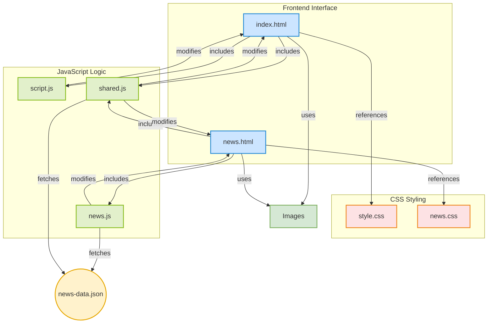

# Bocchi Rocks Clone


## Deskripsi Proyek
Website clone Bocchi the Rock! dengan fitur dinamis dan animasi interaktif. **Update terbaru** sekarang menggunakan sistem data terpusat untuk konten berita.

## Fitur Utama
- 🎨 **Sistem Berita Dinamis** (Baru!)
  - Data terpusat di `news-data.json`
  - Auto-generate konten di index.html dan news.html
  - Tampilkan 3 berita terbaru di homepage
- 🌟 **Animasi GSAP**
  - Transisi halaman
  - Efek hover interaktif
  - Scroll animations
- 📱 **Responsive Design**
  - Mobile-first approach
  - Adaptif untuk semua device

## Struktur Folder Terbaru
```
📂 bocchi-rocks-clone
├── 📂 assets
│   ├── 📂 css
│   │   ├── news.css       # Styles khusus halaman berita
│   │   └── style.css      # Styles utama
│   ├── 📂 data            # Folder baru!
│   │   └── news-data.json # Sumber data terpusat
│   ├── 📂 img
│   │   ├── bocch1.jpeg
│   │   ├── btr-stage.jpeg
│   │   └── logo.svg
│   └── 📂 js
│       ├── news.js        # Logic halaman berita
│       ├── script.js      # Logic utama
│       └── shared.js      # Baru! Logic bersama
├── index.html
├── news.html
└── README.md
```

## Diagram Arsitektur


## Cara Menjalankan
```bash
git clone https://github.com/YunggiAlyana/bocchi-rocks-clone.git
cd bocchi-rocks-clone
# Buka di browser favorit Anda
```

## Teknologi Terbaru
- 🛠️ **Core**
  - HTML5 Semantik
  - CSS3 Modern (Flexbox, Grid, Variables)
- 🚀 **JavaScript**
  - Vanilla ES6+
  - GSAP 3.12.2 (Animasi)
  - Fetch API (Data JSON)
- 🔧 **Tools**
  - Git Version Control
  - Live Server Development

## Kontribusi
1. Fork repository
2. Buat branch fitur (`git checkout -b fitur-anda`)
3. Commit perubahan (`git commit -am 'Tambahkan fitur'`)
4. Push ke branch (`git push origin fitur-anda`)
5. Buat Pull Request

**Panduan Commit Message:**
- `feat`: Untuk fitur baru
- `fix`: Untuk perbaikan bug
- `docs`: Perubahan dokumentasi
- `style`: Perbaikan format/style

## Lisensi
Proyek edukasi open-source. Tidak berafiliasi dengan pemilik hak cipta Bocchi the Rock!.

---
✨ **Dukung dengan memberi ⭐ jika project ini membantu!**

